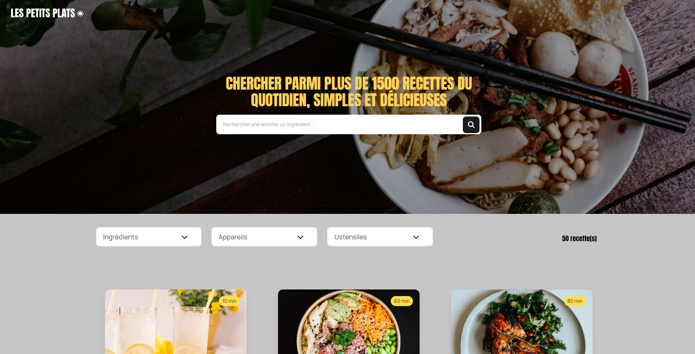

<a name="readme-top"></a>
<!-- PROJECT LOGO -->
<br />
<div align="center">
  <a href="">
    
  </a>

<!-- TABLE OF CONTENTS -->
<details>
  <summary>Table des matières</summary>
  <ol>
    <li><a href="#a-propos-du-projet">À propos du projet</a></li>
    <li><a href="#langagesutilises">langages Utilisés</a></li>
    <li><a href="#missions">Missions</a></li>
    <li><a href="#installation">Installation</a></li>
    <li><a href="#contact">Contact</a></li>
  </ol>
</details>


<!-- ABOUT THE PROJECT -->
## À propos du projet

Les Petits Plats est le projet 7 de ma formation OpenClassroom, dont la mission était de développer un algorithme de recherche (2 versions) efficace pour une plateforme de recettes de cuisine.

Puis une analyse de leurs performances. (Jsben.ch).

Une fois l'algo terminé, documentation à mettre en place et aussi chose importante, durant tout le projet il fallait donc prendre en compte les principes du Green Code, ainsi un algorithme qui soit non seulement performant mais aussi respectueux de l'environnement.

La première tâche était de concevoir l'interface utilisateur du site en utilisant Tailwind et ensuite implémenter chacune des 2 versions de l'algorithme de recherche, chacun étant développé sur une branche de ce projet !
 

 

## Langages utilisés et autres technologies utilisées


## Missions

* Algorithmie
* Green It
* JavaScript Vanilla
* Tailwind CSS


## Installation

1. Clonez le repository de l'application
   ```sh
   git clone https://github.com/AurelieDuynslaeger/Projet-7-OCR---Les-Petits-Plats
   ```

2. Lancez l'application avec Live Server !
  
## Contact

Aurélie D. - [GitHub](https://github.com/AurelieDuynslaeger/)

<!-- MARKDOWN LINKS & IMAGES -->


